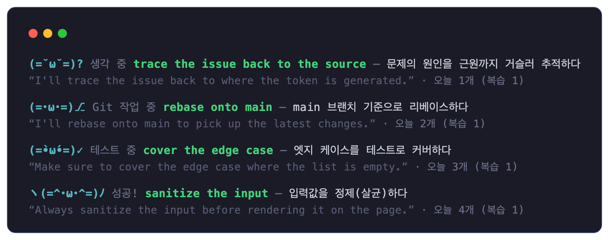
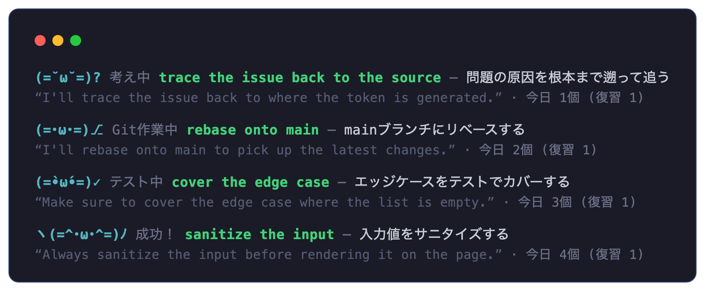

<div align="center">

# `(=^･ω･^=)` cccat — Claude Code Cat

**Claude Code が考えている間に、ステータスラインで英語をひとさじ。**

[English](README.md) · [한국어](README.ko.md) · **日本語**

[](https://github.com/dkdannyboy/cccat/actions/workflows/test.yml)
[](LICENSE)
[](package.json)
[](docs/PRIVACY.md)
[](content/pack-core.json)
[](#説明の言語)

</div>

cccat は、Claude Code のアイドル時間（考え中、ツール実行中、応答待ちなど）を、英語が母語でない
開発者のためのちょっとした英語学習の瞬間に変えるローカル専用のオープンソースツールです。
アニメーションするカオモジ猫がステータスラインに座り、いま Claude Code が何をしているかを表しつつ、
その隣に開発現場ですぐ使える英語表現を **あなたの言語の説明** つきで表示します。

説明は現在 **韓国語** と **日本語** に対応しており、設計上、言語の追加はオーバーレイファイルを
1 つ置くだけです（英語表現自体は共有されます）。

<table>
<tr>
<td align="center"><b>英語表現 + 韓国語の説明</b></td>
<td align="center"><b>英語表現 + 日本語の説明</b></td>
</tr>
<tr>
<td></td>
<td></td>
</tr>
</table>

<sub>実際の cccat ステータスラインのレンダリングエンジンで生成した画面です（`cccat lang ko` / `cccat lang ja`）。
ターミナルでは Claude Code の状態に応じて猫の表情とスピナーがリアルタイムで動き、状態ラベル
（考え中 / Git作業中 / テスト中 / 成功 …）と説明の両方が選んだ言語に従います。実際の Claude Code TUI の
キャプチャは [docs/VERIFICATION.md](docs/VERIFICATION.md) を参照してください。</sub>

## 目次

- [なぜ作ったか](#なぜ作ったか)
- [3秒でわかる](#3秒でわかる)
- [必要環境](#必要環境)
- [インストール](#インストール)
- [説明の言語](#説明の言語)
- [独自のステータスラインを持つプロジェクト](#独自のステータスラインを持つプロジェクト)
- [使い方](#使い方)
- [CLI リファレンス](#cli-リファレンス)
- [設定](#設定)
- [アンインストール](#アンインストール)
- [プライバシー](#プライバシー)
- [FAQ](#faq)
- [ドキュメント](#ドキュメント)
- [ライセンス](#ライセンス)

## なぜ作ったか

Claude Code を使っていると、応答を待つ細切れの時間がよく生まれます。その数秒を、スクロールして
やり過ごすのではなく、`stage the changes`、`cover the edge case`、`clean build` のような、実際に
毎日使う開発英語を学ぶ時間に変えよう、というアイデアです。100% ローカルで動作し、ネットワーク
リクエストはゼロ、プロンプトやファイルの内容は一切保存しません。

## 3秒でわかる

| | |
|---|---|
| 🐱 **キャラクター** | Claude の状態（考え中 / 読み込み / 作成 / テスト / git / エラー / 成功 …）に応じて表情が変わるアニメーション猫 |
| 🌐 **母語での説明** | 開発現場ですぐ使える英語表現 + 自然な母語の説明 + 例文。現在は韓国語・日本語 |
| 🎯 **文脈ベース** | いま行っている作業（ファイル種別・コマンド）に合った表現を優先的に選択 |
| 🔁 **復習** | 間隔反復アルゴリズムで、以前の表現を適切なタイミングで再提示 |
| 🔒 **ローカル専用** | ネットワークリクエストゼロ。プロンプトやファイル内容は保存しない |
| 🆓 **無料 / オープンソース** | アカウント・課金・サーバーなし。MIT ライセンス |

## 必要環境

- Node.js **18 以上**（`npx` は Node に同梱）
- Claude Code（2.1.201 / macOS で検証済み — [docs/COMPATIBILITY.md](docs/COMPATIBILITY.md) 参照）

## インストール

### 方法 1 — npx（最も簡単、クローン不要）

```sh
npx github:dkdannyboy/cccat install
```

クローンもグローバルインストールも不要、1 行で完了します。後で
`npx github:dkdannyboy/cccat uninstall` で削除できます。

### 方法 2 — ワンライナーのインストールスクリプト

```sh
curl -fsSL https://raw.githubusercontent.com/dkdannyboy/cccat/main/scripts/install.sh | sh
```

リポジトリを `~/.cccat/app` にクローン（または更新）してから `cccat install` を実行します。

### 方法 3 — クローン（開発 / コントリビュート用）

```sh
git clone https://github.com/dkdannyboy/cccat.git
cd cccat
node bin/cccat.js install     # または: npm install -g . && cccat install
```

インストール後に Claude Code を再起動すると、ステータスラインに猫が現れます。

### `install` が行うこと

- `~/.claude/settings.json` をタイムスタンプ付きで `~/.cccat/backup/` にバックアップ
- 自身のソースを `~/.cccat/app` にコピーし、フックが安定したパスを参照するようにする
  （npx のキャッシュパスは掃除されると壊れるため）
- 既存のステータスラインがある場合は **決して削除せず**、cccat がそれをラップして、既存の出力が常に
  先に表示され、その下に cccat の行が並ぶようにする（既存の出力は 5 秒キャッシュ）
- **9 個** のフックイベントを登録（`UserPromptSubmit`、`PreToolUse`、`PostToolUseFailure`、`Stop`、
  `Notification`、`SubagentStart`、`SubagentStop`、`SessionStart`、`SessionEnd`）。既存のフックは
  そのまま。パフォーマンスのためツール呼び出しごとに発生する `PostToolUse` は登録せず、
  `PreToolUse` は 2 秒スロットルで無駄な実行を省く
- ステータスラインの `refreshInterval`（デフォルト 1 秒）を設定し、イベントがなくてもアニメーションが
  動き続けるようにする。アニメーションを切る（`config show_animation false`）とタイマーは無くなる
- 実行時に `node` を探すランチャーを置くので、後で Node をアップグレードしてもフックが壊れない
- 再インストールしても安全（冪等）— 行が重複しない

## 説明の言語

デフォルトの説明言語は韓国語です。日本語も完全対応しています（240 以上の英語表現をすべて翻訳）。
いつでも切り替えられます。

```sh
cccat lang ja     # 日本語の説明に切り替え
cccat lang ko     # 韓国語に戻す
cccat lang        # 現在の言語と対応言語を表示
```

変更は即座に反映されます（再インストール不要）。意味・例文・クイズのヒントもすべて選んだ言語に
従います。翻訳されるのは *説明* だけで、英語表現はすべての言語で共有されます。言語の追加は
`content/i18n/<code>.json` オーバーレイを置くだけです —
[docs/CONTENT_GUIDE.md](docs/CONTENT_GUIDE.md#explanation-languages-i18n) を参照。新しい言語の
オーバーレイのコントリビュート歓迎です。

> 任意の [danielclass.com](https://danielclass.com) の案内（無料の英語学習教材）は、韓国語の
> ユーザーにのみ、1 日 1 回までの頻度で表示されます。

## 独自のステータスラインを持つプロジェクト

一部のプロジェクトは `.claude/settings.json` で独自のステータスラインを定義しています。
プロジェクト設定はユーザー設定より優先されるため、そうしたプロジェクト内では cccat が隠れます。
そのプロジェクトのディレクトリで **一度だけ** 次を実行すると共存できます。

```sh
cccat adopt      # プロジェクトのステータスライン + cccat の行を一緒に表示
cccat unadopt    # 元に戻す
```

`adopt` は git 管理外の `.claude/settings.local.json` にのみ設定を書き込み、チームで共有する
`.claude/settings.json` には一切触れません。`cccat doctor` はこの状況を検出して案内します。

## 使い方

インストール後は何もしなくても動きます。ステータスラインは Claude Code の動作（考え中 / 読み込み /
作成 / テスト / git / エラー …）に追従し、猫の表情と英語表現が変わります。表現はおよそ 30 秒
（デフォルト）ごとに切り替わり、以前見た表現は間隔反復スケジュールにより後で復習として再登場します。

インストールせずにプレビュー：

```sh
cccat demo thinking
```

## CLI リファレンス

| コマンド | 説明 |
|---|---|
| `cccat install` | Claude Code にインストール（設定を自動バックアップ） |
| `cccat uninstall [--purge]` | 削除して元のステータスライン/フックを復元。`--purge` は学習データも削除 |
| `cccat doctor` | インストール状態、ステータスライン、フック数、コンテンツを診断 |
| `cccat lang [code]` | 説明言語の確認/変更（`ko`、`ja`） |
| `cccat adopt` | 独自ステータスラインを持つプロジェクトで共存を設定（`.claude/settings.local.json` に書き込み、`settings.json` には触れない） |
| `cccat unadopt` | `adopt` を取り消して復元 |
| `cccat on` / `cccat off` | 有効化 / 無効化 |
| `cccat pause [分]` / `cccat resume` | 指定分（デフォルト 30）一時停止 / 即再開 |
| `cccat config list` | すべての設定を表示 |
| `cccat config get <key>` | 設定を 1 つ読む |
| `cccat config set <key> <value>` | 設定を変更 |
| `cccat stats` | 今日の数、累計の学習/習得/保存 |
| `cccat today` | 今日見た表現の一覧 |
| `cccat save` | いま表示中の表現を保存 |
| `cccat saved` | 保存した表現の一覧 |
| `cccat reset [--all]` | 学習履歴をリセット（`--all` は状態もリセット） |
| `cccat privacy` | 収集する/しない項目と保存場所 |
| `cccat demo [state]` | インストールせずにレンダリングをプレビュー（実際の回転エンジン） |
| `cccat version` | バージョン表示 |

## 設定

`cccat config set <key> <value>` で変更します。デフォルト値は `lib/config.js` にあります。

| キー | デフォルト | 説明 |
|---|---|---|
| `enabled` | `true` | 全体のオン/オフ |
| `show_character` | `true` | 猫を表示 |
| `show_animation` | `true` | フレームアニメーション |
| `show_english` | `true` | 英語表現を表示 |
| `show_korean` | `true` | 説明を表示（現在の言語で） |
| `show_example` | `true` | 例文の行を表示（広いターミナルのみ） |
| `quiz_ratio` | `0.2` | 既出の表現を穴埋めクイズにする割合（0〜1） |
| `rotate_sec` | `30` | 表現を切り替える最小間隔（秒） |
| `refresh_sec` | `1` | アニメーション更新間隔（秒、1〜10）。変更後に `cccat install` を再実行 |
| `review_ratio` | `0.3` | 新規表現より復習を優先する確率（0〜1） |
| `context_aware` | `true` | 直近の作業（ファイル種別 / コマンド）に合う表現を優先 |
| `promo` | `true` | danielclass.com の案内を表示（1 日 1 回まで、韓国語ユーザーのみ） |
| `language` | `ko` | 説明の言語（`ko`、`ja`）。`cccat lang <code>` でも変更可 |
| `compact` | `false` | 強制的に 1 行モード |
| `difficulty_max` | `3` | 表示する表現の最大難易度（1〜3） |

## アンインストール

```sh
cccat uninstall           # ステータスライン/フックを復元、学習データは保持
cccat uninstall --purge   # 上記 + ~/.cccat をすべて削除
```

## プライバシー

100% ローカル、ネットワークリクエストはゼロです。保存するのは、ツール種別・ファイル拡張子・
コマンドのカテゴリ・キーワードで一致したタグ・学習履歴のみ。プロンプト本文・ファイル内容・
フルパス・環境変数・シークレットは一切保存しません。詳しくは [docs/PRIVACY.md](docs/PRIVACY.md)
または `cccat privacy` を参照。

## FAQ

**Claude Code は遅くなりますか？**
体感できるほどではありません。ツール呼び出しごとに `PreToolUse` フックが約 80ms 追加します
（大半は Node のコールドスタート）。連続した呼び出しでは 2 秒スロットルでそれすら省きます。
フックはどんな入力でも静かに終了するよう設計されており、Claude Code の作業を妨げません。

**CPU / バッテリーを多く使いますか？**
アニメーションのためステータスラインが `refresh_sec`（デフォルト 1 秒）ごとに再実行されます
（1 回あたり約 0.1 秒の CPU）。`cccat config set refresh_sec 3` で減らすか、
`cccat config set show_animation false` でタイマーを完全に無くし、その後 `cccat install` を再実行
してください。

**表現はどこから来るの？ AI がその場で生成するの？**
検収済みの 240 以上の表現がローカルに同梱されており、外部 API なしで動作します。ライブの LLM
呼び出しはありません（ゆえにネットワークゼロ・コストゼロ）。独自の表現は下記のユーザーパックで
追加できます。

**すでにステータスラインを使っています。**
install は既存のステータスラインコマンドをラップします。その出力は常に 1 行目に表示され、
その後に cccat の行が続きます。何も削除されません。

**プロジェクトが独自のステータスラインを定義しています。**
そのプロジェクトのディレクトリで `cccat adopt` を一度実行してください —
[独自のステータスラインを持つプロジェクト](#独自のステータスラインを持つプロジェクト) を参照。

**他の言語の説明も使えますか？**
現在は韓国語と日本語です。言語の追加はオーバーレイファイル 1 つ
（[docs/CONTENT_GUIDE.md](docs/CONTENT_GUIDE.md#explanation-languages-i18n)）で、PR 歓迎です。

**自分の表現を追加できますか？**
`~/.cccat/packs/*.json` にパックを置くとコアパックと一緒に読み込まれます。スキーマは
[docs/CONTENT_GUIDE.md](docs/CONTENT_GUIDE.md) を参照。

## ドキュメント

| ドキュメント | 内容 |
|---|---|
| [ARCHITECTURE.md](docs/ARCHITECTURE.md) | データフロー、モジュール構成、設計判断 |
| [CONTENT_GUIDE.md](docs/CONTENT_GUIDE.md) | コンテンツスキーマ、タグ語彙、ユーザーパック、i18n オーバーレイ |
| [PRIVACY.md](docs/PRIVACY.md) | 収集する/しない項目、保存場所、削除方法 |
| [COMPATIBILITY.md](docs/COMPATIBILITY.md) | 対応 / 非対応環境 |
| [KNOWN_LIMITATIONS.md](docs/KNOWN_LIMITATIONS.md) | 既知の制限 |
| [VERIFICATION.md](docs/VERIFICATION.md) | 実際の Claude Code での検証ログ |
| [FUTURE.md](FUTURE.md) | ロードマップ |

## コントリビュート

バグ報告や表現の提案を歓迎します — issue または PR を開いてください。テストは `npm test` で実行し、
PR は CI（Node 18/20/22 × Linux/macOS）を通す必要があります。新しい言語のオーバーレイは特に歓迎です。

## ライセンス

MIT — [LICENSE](LICENSE)
